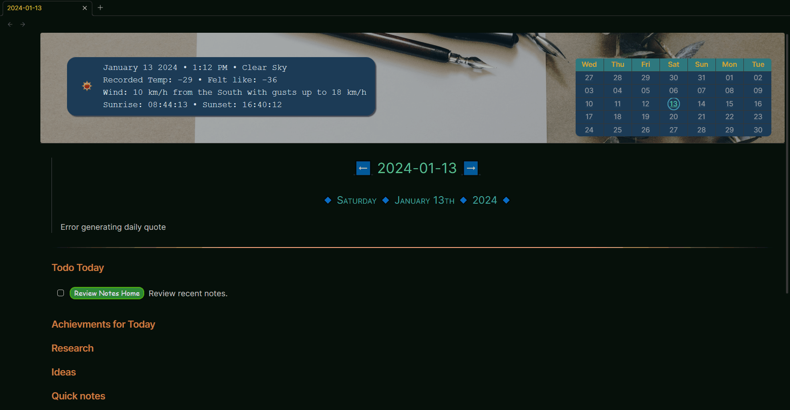

# My Daily Note Example

## Demonstration Information

This is an example of how I add the weather information into my Daily Notes. The recorded temperature is the permanently recorded temperature available at the time of my Daily Notes creation. When I hover over that it shows me the current temperature information. This is achieved through the use of CSS. All the code involved is also listed in this document.

It makes use of the following plugins, [banners](https://github.com/noatpad/obsidian-banners), [templater](https://github.com/SilentVoid13/Templater), and [buttons](https://github.com/shabegom/buttons) and of course this plugin [OpenWeather](https://github.com/willasm/obsidian-open-weather).

### Screenshot



## My Daily Note Template

```markdown
---
cssclass: daily
banner: "![[daily-note-banner.jpg]]"
banner_x: 0.5
banner_y: 0.3
title: <%tp.file.title%>
created: <%tp.date.now()%>
author: William McKeever
type: journal
webclip: false
tags: [daily_note]
aliases: []
description: Daily Note
---
<div class="weather_historical_3">%weather3%</div>
<div class="weather_current_4"></div>
<%* app.commands.executeCommandById("obsidian-open-weather:replace-template-string")%>

> ###### [[<% tp.date.now("YYYY-MM-DD", -1, tp.file.title, "YYYY-MM-DD") %>|⬅]] <% tp.file.title %> [[<% tp.date.now("YYYY-MM-DD", 1, tp.file.title, "YYYY-MM-DD") %>|➡]]
> ##### 🔹 <% tp.date.now("dddd 🔹 MMMM Do 🔹 YYYY", 0, tp.file.title, "YYYY-MM-DD") %> 🔹
>
<%tp.web.daily_quote()%>

---

## Todo Today
- [ ] `button-review` Review recent notes.

## Achievments for Today

## Research

## Ideas

## Quick notes

```

## My Daily Notes CSS (dailyNote.css)

```css
/* Daily Note Styling */
.daily {
    padding-left: 25px !important;
    padding-right: 25px !important;
    padding-top: 20px !important;
}

/* Transition Effect Weather One */
.weather_current_1,
.weather_historical_1 {
  transition: 0.3s;
}

/* Transition Effect Weather Two */
.weather_current_2,
.weather_historical_2 {
  transition: 0.3s;
}

/* Transition Effect Weather Three */
.weather_current_3,
.weather_historical_3 {
  transition: 0.3s;
}

/* Transition Effect Weather Four */
.weather_current_4,
.weather_historical_4 {
  transition: 0.3s;
}

/* Historical & Current weather One, Two, Three and Four common settings */
.weather_historical_1, .weather_current_1, .weather_historical_2, .weather_current_2, .weather_historical_3, .weather_current_3, .weather_historical_4, .weather_current_4 {
    display: flex;
    float: left;
    clear: left;
    align-items: center;
    top: 80px;
    left: 35px;
    position: absolute;
    font-family: monospace;
    font-size: 14pt !important;
    margin: 10px 5px;
    padding: 10px 20px;
    border-radius: 20px;
    box-shadow: 3px 3px 2px #414654;
    cursor: pointer;
}

/* Historical weather at top of the document over banner */
.weather_historical_1, .weather_historical_2, .weather_historical_3, .weather_historical_4 {
    color: #d0dce9;
    background-color: #0d3d56;
}

/* Current weather at top of the document over banner */
.weather_current_1, .weather_current_2, .weather_current_3, .weather_current_4 {
    color: #c4caa5;
    background-color: #133e2c;
    opacity: 0;
}

/* Show Current weather One on hover */
.weather_current_1:hover {
    opacity: 1;
}

/* Show Current weather Two on hover */
.weather_current_2:hover {
    opacity: 1;
}

/* Show Current weather Three on hover */
.weather_current_3:hover {
    opacity: 1;
}

/* Show Current weather Four on hover */
.weather_current_4:hover {
    opacity: 1;
}

/* Daily Note Name H6 Styling (YYYY-MM-DD) */
.daily h6 {
    font-size: 1.75em;
    color: #4cbf90;
    border-width: 1px;
    padding-bottom: 3px;
    text-align: center;
}

/* Daily Note Date H5 Styling (🔹 Thursday 🔹 10th November 🔹 2022 🔹) */
.daily h5 {
    font-size: 1.25em;
    color: #23a49d;
    border-width: 1px;
    padding-bottom: 3px;
    text-align: center;
}

/* Hide the frontmatter for Daily Notes */
.daily .frontmatter-container {
    display: none;
}

```

## My Review Notes Home Button Definition

```button
name Review Notes Home
type link
action obsidian://open?vault=Programming&file=Review%20Notes%20Home
class button
```
^button-review

## My Review Notes Home Button CSS (buttons.css)

```css
.button.button {
  background-color: #128075;
  border: 2px solid #4dad0d;
  border-radius: 12px;
  color: #efefef;
  text-align: center;
  text-decoration: none;
  margin: 0px 5px;
  font-family: cursive;
  font-size: 12pt;
  width: auto;
  height: 1.75rem;
  cursor: pointer;
  transition: all 0.33s ease;
}

.button.button:hover {
  background-color: #15a595;
  color: #f0f0f0;
  border: 2px solid #99bd10;
}
```
